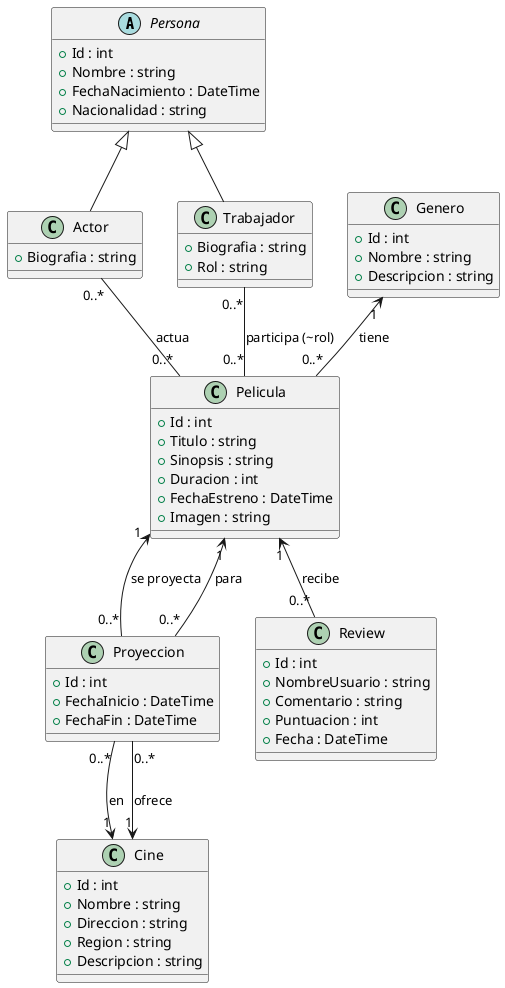

# Modelo de Datos - PeliculasWeb

Este sistema funciona como un IMDb local, permitiendo a los usuarios consultar información sobre películas, cines, cartelera y opiniones. No hay reservas, pagos ni suscripciones: todo es informativo.

## Funcionalidades principales

- Ver películas, reviews y comentarios.
- Consultar en qué cines y horarios se proyecta cada película.
- Cada cine tiene su propia cartelera con películas y horarios.
- Los usuarios pueden dejar comentarios y puntuaciones (reviews).

---

## Estructura del Modelo de Datos

### 1. Persona (abstracta)

- **Id**
- **Nombre**
- **FechaNacimiento**
- **Nacionalidad**

#### Heredan de Persona:

- **Actor**: Biografía, relación muchos a muchos con Película.
- **Director**: Biografía, relación uno a muchos con Película.

### 2. Género

- **Id**
- **Nombre**
- **Descripción**

### 3. Película

- **Id**
- **Título**
- **Sinopsis**
- **Duración**
- **FechaEstreno**
- **Imagen**
- **GeneroId** (FK)
- **DirectorId** (FK)
- **Actores** (muchos a muchos)
- **Proyecciones** (uno a muchos): en qué cine y cuándo se proyecta.
- **Reviews** (uno a muchos)

### 4. Cine

- **Id**
- **Nombre**
- **Dirección**
- **Región**
- **Descripción**
- **Proyecciones** (uno a muchos)

### 5. Proyección (Cartelera)

- **Id**
- **PeliculaId** (FK)
- **CineId** (FK)
- **FechaHora**

### 6. Review

- **Id**
- **PeliculaId** (FK)
- **NombreUsuario**
- **Comentario**
- **Puntuación**
- **Fecha**

---

## Relaciones clave

- **Película ↔ Actor** (Muchos a Muchos)
- **Película ↔ Director** (Uno a Muchos)
- **Película ↔ Género** (Uno a Muchos)
- **Película ↔ Proyección** (Uno a Muchos)
- **Cine ↔ Proyección** (Uno a Muchos)
- **Película ↔ Review** (Uno a Muchos)

---

## Flujo de navegación web

- **Página de inicio:** Listado de películas, buscador y filtros.
- **Página de película:** Detalles, sinopsis, actores, director, género, reviews, lista de cines y horarios donde se proyecta.
- **Página de cine:** Descripción, dirección, cartelera actual (películas y horarios).
- **Formulario de review:** Cualquier visitante puede dejar comentario y puntuación.

---

## Diagrama PlantUML del modelo de datos

